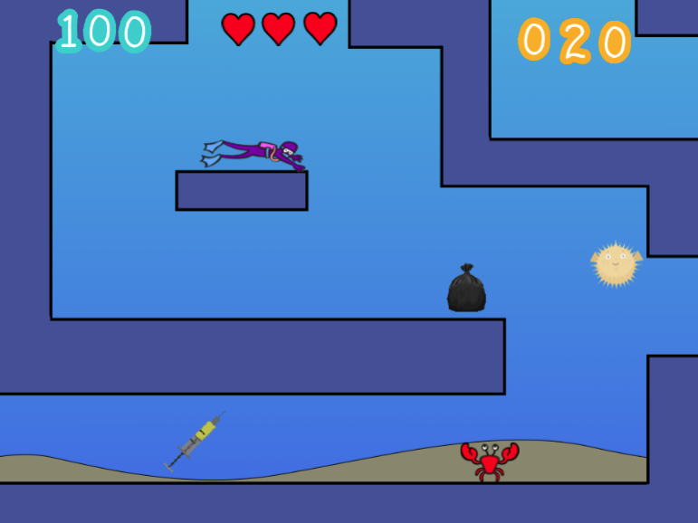
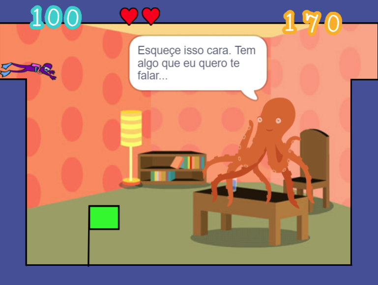

# Deep: A Diver's Odissey
## Equipe:
- João Marcos do Nascimento
- Luís Henrique Tavares
- Renan dos Santos Mello de Andrade
- Vitor Neves dos Santos
## O que é?

Deep: A Diver's Odissey é um jogo desenvolvido na plataforma Scratch em um período de 7 meses por alunos do 1 Ano do Ensino Médio do CEFET/RJ. O objetivo do jogo consiste em retirar a maior quantidade de lixo de diversas partes do mar enquanto escapa de animais perigosos e coletar itens especiais.

  
  

